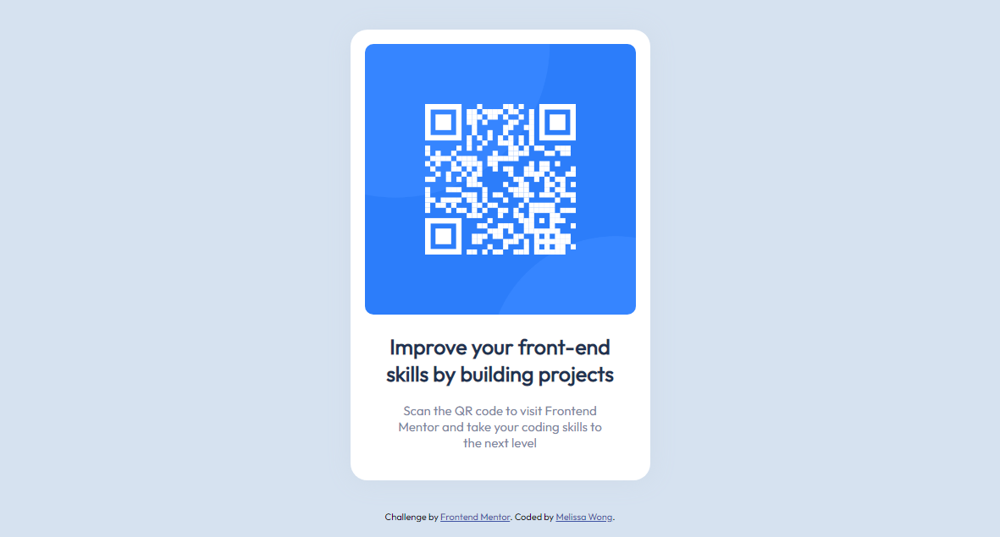

# Frontend Mentor - QR code component solution

This is a solution to the [QR code component challenge on Frontend Mentor](https://www.frontendmentor.io/challenges/qr-code-component-iux_sIO_H). Frontend Mentor challenges help you improve your coding skills by building realistic projects. 

## Table of contents

- [Overview](#overview)
  - [Screenshot](#screenshot)
  - [Links](#links)
- [My process](#my-process)
  - [Built with](#built-with)
  - [What I learned](#what-i-learned)
  - [Continued development](#continued-development)


## Overview

### Screenshot




### Links

- Solution URL: [Github Repository](https://github.com/nocatolie/html-qr-code-component)
- Live Site URL: [Github Pages](https://nocatolie.github.io/html-qr-code-component/)

## My process

### Built with

- Semantic HTML5 markup
- CSS properties
- Flexbox
- Mobile-first workflow


### What I learned

I started coding without using flexbox and saw that the page was not responsive not to mention that the footer overlapped the qr code.

So I started researching a way to make my website more responsive and that led me to experiment with flexbox.

Flexbox main idea is to give the container the ability to alter its item’s sizes to best fill the available space, to prevent overflow and this is what I needed.

Here are some examples where I use flexbox:


```css
.container{
    height: 100vh;
    display: flex;
    flex-direction: column;
    justify-content: space-between;
    align-items: center;
}
```
```css
.envoltorio{
    flex: 1;
    display: flex;
    align-content: center;
    justify-content: center;
    flex-direction: column;
}
```


### Continued development

I'm still not completely comfortable using flexbox but is a technique I found very useful and that I want to refine and perfect.

This will help me in many future proyects.


